R2D2を使うための環境設定
===============================

R2D2コードを使って計算するだけならば任意のfortranコンパイラ, FFTW, MPIのみがあれば良い。
Pythonコードを使って解析する場合は、いくつかのモジュールが必要なので、そのインストールの方法もここで説明する。

Fortranコードの環境設定
----------------------------------------
Mac
~~~~~~~~~~~~~~~~~~~~~~~~~~~~~~~~~~~~~~~~
Homebrewを用いて、必要なコンパイラ・ライブラリをインストールすることを推奨している。
コンパイラとFFTWのインクルードファイルとライブラリの位置だけ指定すれば良いので、
任意の方法でインストールして構わない。Homebrew以外を用いる場合は、便宜make/Makefileを編集すること。

Homebrewのインストール

.. code::

    /usr/bin/ruby -e "$(curl -fsSL https://raw.githubusercontent.com/Homebrew/install/master/install)"

gfortranのインストール

.. code::

    brew install gcc

OpenMPIのインストール

.. code::

    brew install openmpi

FFTWのインストール

.. code:: 

    brew install fftw

Linux (Ubuntu 22.04)
~~~~~~~~~~~~~~~~~~~~~~~~~~~~~~~~~~~~~~~~

ここでは、Ubuntu 22.04の場合のみを説明する。

gfortranのインストール

.. code::

    sudo apt-get install gfortran

OpenMPIのインストール

.. code::

    sudo apt-get install openmpi-doc openmpi-bin libopenmpi-dev

FFTWのインストール

.. code:: 
    
     sudo apt-get install libfftw3-dev

Pythonコードの環境設定
----------------------------------------
各自の方法でpythonをインストールすれば良いが、ここではminiforgeを用いる方法を説明する。
miniforgeをインストールし、以下に示すモジュール群をインストールする。
MacとLinuxで共通する部分が多いのでまとめて説明を記す。

詳しくは
`miniforgeのGitHubレポジトリ <https://github.com/conda-forge/miniforge>`_ を参照する。以下のコマンドでインストーラーをダウンロードする。

- Mac
    .. code:: shell

        curl -L -O "https://github.com/conda-forge/miniforge/releases/latest/download/Miniforge3-$(uname)-$(uname -m).sh"

- Linux
    .. code::

        wget "https://github.com/conda-forge/miniforge/releases/latest/download/Miniforge3-$(uname)-$(uname -m).sh"

    インストールするディレクトリは :code:`/home_directory/miniforge3` とする(デフォルト)。  インストール後、シェルの初期化ファイルに以下の行を追加して、miniforgeのbinディレクトリにPATHを通す。 :code:`/ホームディレクトリ/anaconda3` にPATHを通す。conda環境は重いので、必要なときにのみPATHを通すことを推奨する。
    スパコンのログインノードなどでもインストール方法は共通である。

ipythonの初期設定
~~~~~~~~~~~~~~~~~~~~~~~~~~~~~~~~~~~~~~~~
以下は必須ではないが、ipythonを使う時の初期設定ファイルである。
:code:`~/.ipython/profile_default/startup/00_first.py`
というファイルを作りそこに以下のように記す。

.. code:: python

    import sys, os
    import matplotlib.pyplot as plt
    import numpy as np
    from matplotlib.pyplot import pcolormesh,plot,clf,close
    from numpy import sin,cos,tan,arcsin,arccos,arctan,exp,log,log2,log10,mod,sqrt,absolute,sinh,cosh,tanh,pi,arange
    plt.ion()
    from IPython.core.magic import register_line_magic
    @register_line_magic
    def r(line):
    get_ipython().run_line_magic('run', ' -i ' + line)
    del r                                                                              
                                      
                                  
最後に記した設定によって、

.. code::

    r (Pythonスクリプト名)

とするだけで、スクリプトを実行できるようになる。

Googleスプレッドシート利用
~~~~~~~~~~~~~~~~~~~~~~~~~~~~~~~~~~~~~~~~

計算設定などをGoogleスプレッドシートにまとめておくと便利である。
R2D2では、Pythonから直接Googleスプレッドシートに送信する方法を提供しているので、利用したい方は検討されたい。

手順については、 `こちら <https://qiita.com/akabei/items/0eac37cb852ad476c6b9>`_ を参考にしたが、少し手順が違うのでこのページでも解説する。

まずは関連するモジュールのインストール。

.. code:: shell

    pip install gspread
    pip install google-auth

プロキシなどの影響でpipが使えない時は以下のようにする

gspreadのインストール

.. code:: shell

    git clone git@github.com:burnash/gspread.git
    cd gspread
    ipython setup.py install

oauth2clientのインストール

.. code:: shell

    git clone git@github.com:googleapis/oauth2client.git
    cd oauth2client
    ipython setup.py install

プロジェクト作成
||||||||||||||||||||||||||||||

ウェブブラウザで https://console.developers.google.com/cloud-resource-manager?pli=1 にアクセス。

「プロジェクトを作成」として、プロジェクトを作成

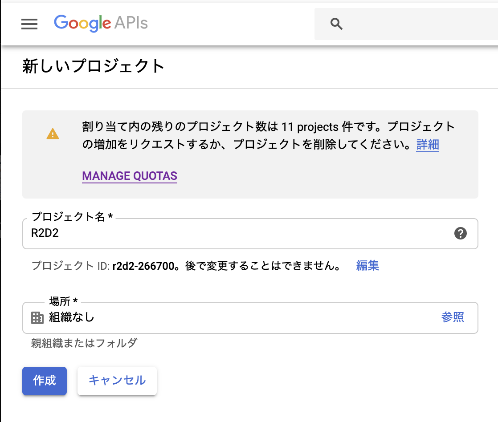

プロジェクト名はR2D2, 場所は組織なしとする。

API有効化
||||||||||||||||||||||||||||||

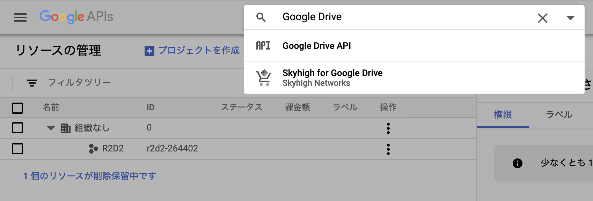

次に検索窓にGoogle Driveと打ち込んで、Google DriveのAPIを検索

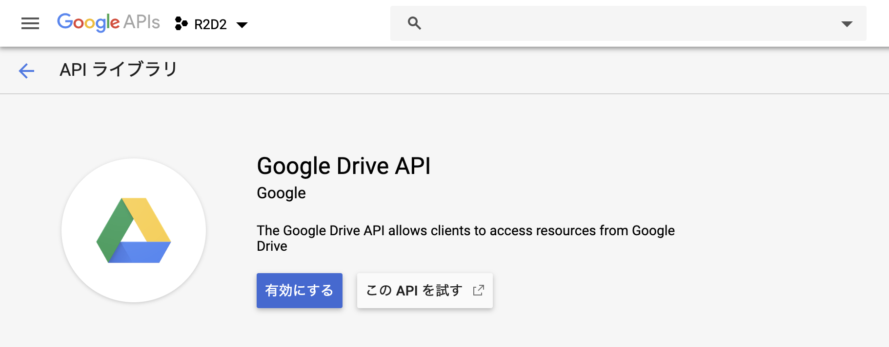

Google Drive APIを有効にする。

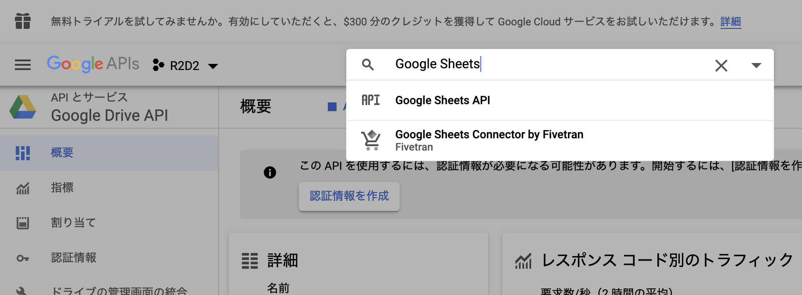

同様にGoogle Sheetsと検索

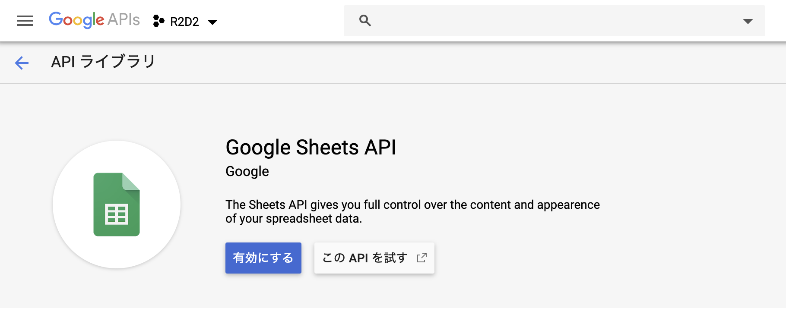

Google Sheets APIを有効化

サービスアカウント作成
||||||||||||||||||||||||||||||

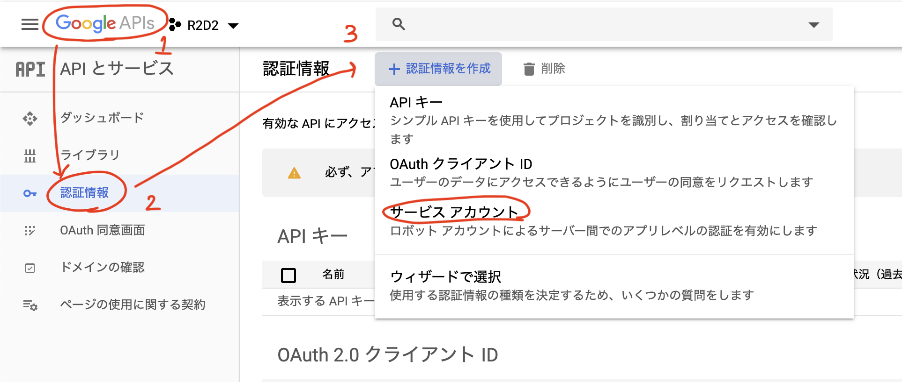

Google APIロゴ → 認証情報 → サービスアカウントとたどる。

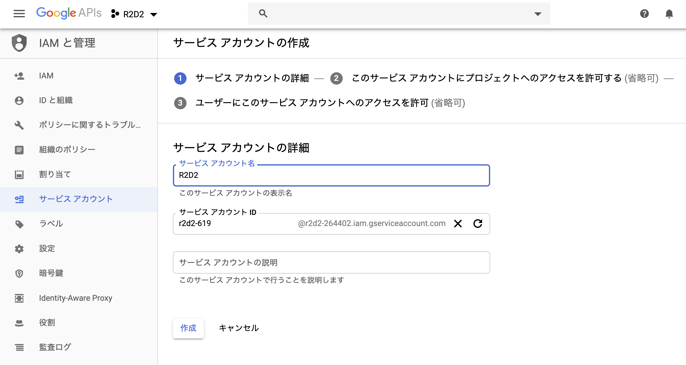

サービスアカウント名はR2D2とする

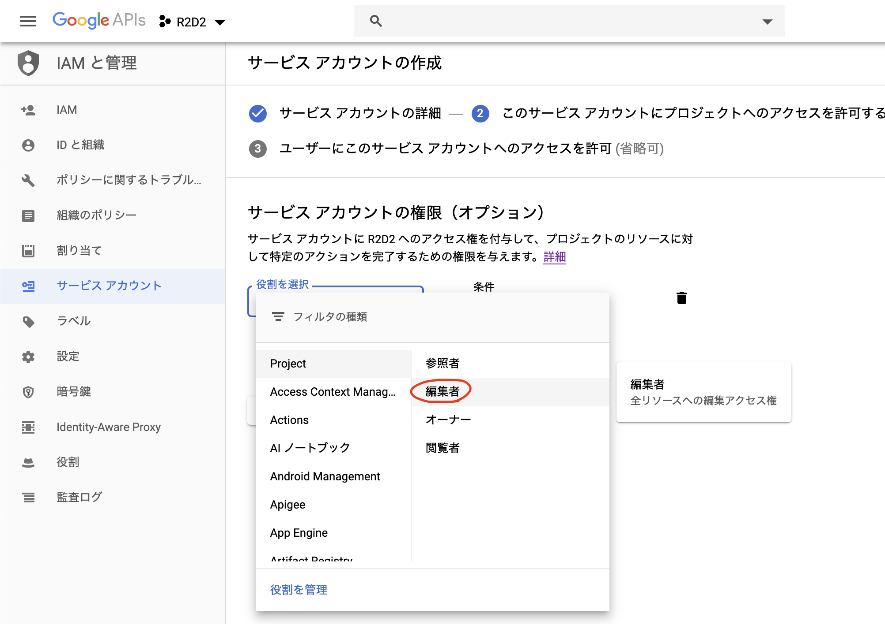

役割は編集者を選択

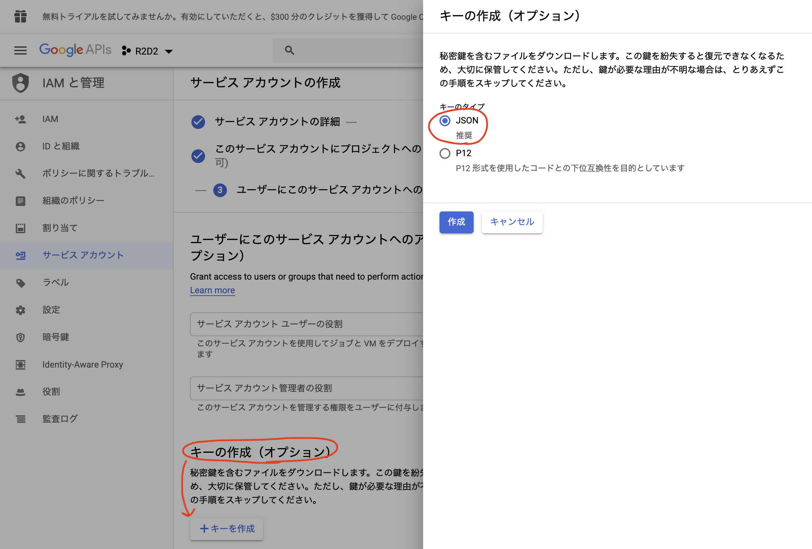

キーの生成ではJSONを選択し、キーを生成する。
ダウンロードしたファイルは、使用する計算機のホームディレクトリにjsonというディレクトリを作成し、その下に配置する。そのディレクトリには、このjsonファイル以外には何も置かないこと。

スプレッドシート作成
||||||||||||||||||||||||||||||

以下のウェブサイトからGoogleスプレッドシートを作成
https://docs.google.com/spreadsheets/create

名前はプロジェクト名とする。R2D2では、pyディレクトリの上のディレクトリ名を読みそれをスプレッドシートの名前として情報を送るので、ディレクトリと同じ名前にする。

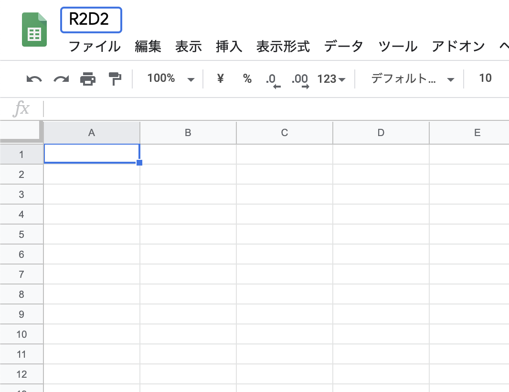

講習会ではR2D2としておく。

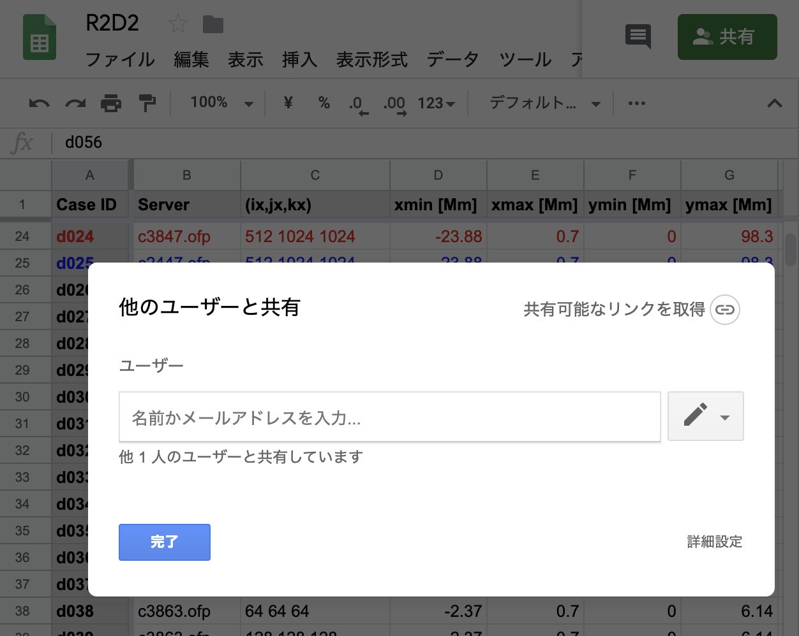

共有をクリックし、ダウンロードしたjsonファイルの中のclient_email行のEメールアドレスをコピーして、貼り付け。ここまでで、R2D2からGoogleスプレッドシートにアクセスできるようになる。

台帳の送信 (r2d2plus-ledger)
||||||||||||||||||||||||||||||

``pyR2D2.Data`` を読み込まずに、プロジェクトの全ラン (``<project>/run/dNNN``) の設定と
状態をシートへ送るコマンド ``r2d2plus-ledger`` がある (pyR2D2 を入れると入る)。
``push`` にだけ ``gspread`` と ``google-auth`` が要る (``pip install "pyR2D2[ledger]"``)。
計算ノードでは動かさず、ログインノードか手元で使う。

.. code:: shell

    r2d2plus-ledger status ~/work/proj/run            # 各ランの状態と「未送信の変更」の有無 (送らない)
    r2d2plus-ledger export ~/work/proj/run -o ledger.csv
    r2d2plus-ledger push   ~/work/proj/run --dry-run  # 書くセルを表示するだけ (Google に接続しない)
    r2d2plus-ledger push   ~/work/proj/run            # シート名 = プロジェクト名 (proj)
    r2d2plus-ledger push   ~/work/proj/run --sheet-id <ID> --only d001,d005

- 読むのは ``data/param`` の ``params.dac``・``back.dac``・``run_summary.toml``・``origin.toml``・
  ``runs/<最新>/effective_config.txt``・``run.log`` の末尾と ``restart/*/meta.toml`` の ``[modifiers]``、
  および ``data/`` の使用量 (``--no-du`` で省略) だけ。Fortran 版のラン (``run_summary.toml`` が無い)
  も ``params.dac`` と ``cont_log.txt`` から従来どおりの列を埋める。
- **コードが管理する列**は ``Case ID, Mstar, (ix,jx,kx), xmin … zmax, uni, dx, m ray, dtout, dtout_tau,
  al, RSST, Om, Geometry, origin, update time, Server, 状態, 到達時刻, t_end, step, 形式, 容量, 加工,
  commit, backend, ranks, ms/step``。列は見出しの**単位を除いた名前**で探す (``dtout [s]`` も
  ``dtout [min]`` も ``dtout``。``Gemetry`` は ``Geometry`` の別名)。シートに無い管理列は見出しの右端に
  足す。**それ以外の列 (Note・Finish など) は人の列で、読みも書きもしない**。書くのは管理列のセル
  だけ (セル単位の ``batch_update``) で、行ごと書き戻さない。
- 行は Case ID の番号で決まる (d001 は 2 行目)。欠番の空行や人のメモだけの行はそのまま残る。
  その行の ``Server`` が送り手 (既定はホスト名、``--server`` で指定) と違えば、警告して飛ばす
  (``--force`` で上書き)。
- 単位は列ごとに値に合わせて自動で選び、見出しに書く (時刻 s/min/h/d/yr、長さ km/Mm、容量 MB/GB/TB、
  球・YinYang の動径は R_star、角度は deg)。表示値が 1〜1000 に入る単位のうち、慣用の繰り上がり
  (1000 s 未満は s、48 h 未満は h など) で 1 つに決める。今の見出しの単位で 0.1〜1e4 に収まる間は
  単位を変えない。対になる列 (xmin/xmax・ymin/ymax・zmin/zmax・到達時刻/t_end) は値を合わせて同じ単位にし、
  変えるときも組で一緒に変える (dtout と dtout_tau は独立)。単位が変わると、手元に無いランの行のセルも見出しの旧単位で読んで換算し書き直す
  (表示の 2 桁の丸めの分だけ誤差が入る)。1 列に長さと角度が混ざるときは、見出しを単位なしにして
  各セルに ``6.14 [Mm]`` の形で単位を書く。直交座標の xmin/xmax は従来どおり rstar からの距離。
- 送ると各ランの ``data/param/ledger_sent.toml`` に管理列のハッシュを残す。``status`` はこれと
  比べて未送信の変更を示し、``pyR2D2.Data`` でそのランを開いたときにも
  「台帳へ未送信の変更があります: r2d2plus-ledger push …」と 1 行出る (R2D2plus のランだけ)。
- 従来の ``pyR2D2.write.google.set_cells_gspread`` も同じ処理で書くようになった
  (以前は A〜T 列を位置で上書きし、``Server`` が落ちていた)。

IDLコードの環境設定
----------------------------------------

システムにIDLをインストールすれば、それのみで使える。ここでは説明しない。

最終更新日：|today|